# Guide 4 Pokie fun sexy gaming time

<h3 style="padding-left: 30px;">Info</h3>

* RTX HDR är istället för Windows Auto HDR, till för spel utan HDR implementerat och fungerar bättre, lika så RTX Video enhancements. 
* Flera inställningar kan tweakas per spel, under Nvidia App -> Graphics -> Game Settings. Syns inte spelet så kan man lägga till det manuellt.
* Finns ett litet frågetecken på varje option du kan klicka på för vidare förklaring av vad allt gör, see below
* Du kan klicka på bilderna för att öppna en större version om du behöver se bättre

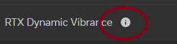

<!-- 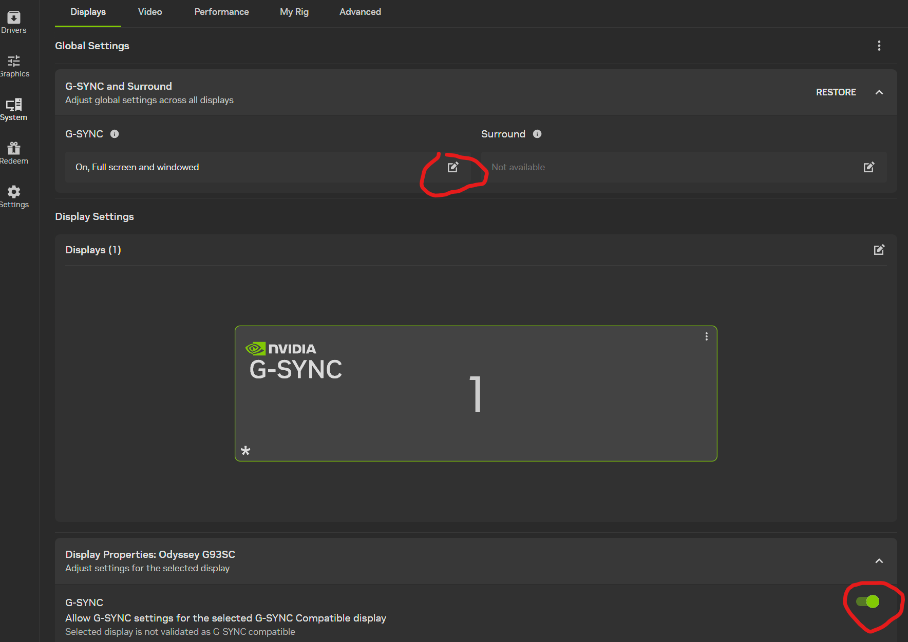 -->

**1: Gå in i Windows Settings -> System -> Display -> HDR. Stäng av Auto HDR igen. Gå också in i Apps -> Video Playback och stäng av Video Enhancements**

<!-- Table for side-by-side images -->
<table><tr>
<td>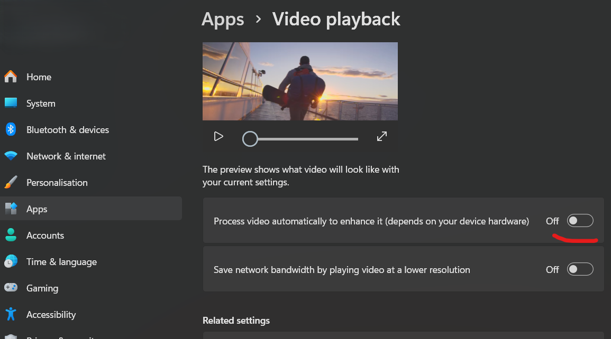</td>
<td>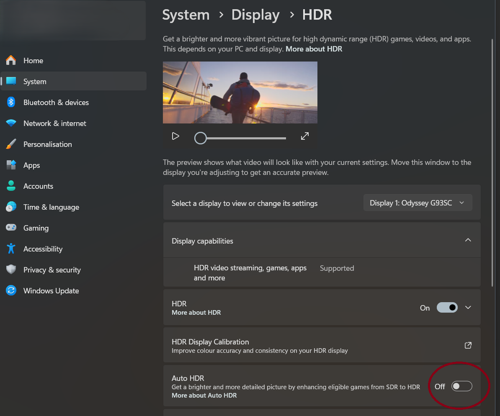</td>
</tr></table>
<!--   -->

**2: Ladda ner Nvidia App och installera om du inte redan har den. [Nvidia App](https://www.nvidia.com/en-us/software/nvidia-app/) - also good for optimizing da vidya game graphics och se till att drivrutiner är uppdaterade.**

**3: Installera [Windows HDR Calibration](https://apps.microsoft.com/detail/9N7F2SM5D1LR?hl=en-us&gl=SE&ocid=pdpshare) från Windows Store (for later)**

4: Öppna Nvidia App. Gå in i System, enabla G-Sync, strunta i om det står att din monitor inte är “G-sync validated”. Sätt på både Fullscreen och Windowed om du vill. Under display properties, se givetvis till att refresh rate är satt på högsta du kan. 144/165 hz på din skärm beroende på om du använder HDMI eller DisplayPort.

<!--  -->

5. Scroll down. Sätt scaling till “no scaling”, scaling device = GPU, override scaling set by games and programs:

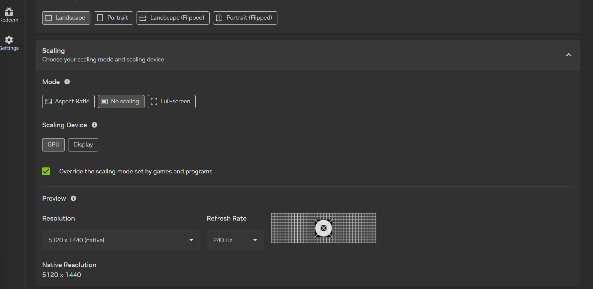
<!--  -->

Om du av någon anledning märker att något spel eller program ser weird ut helt plötsligt så kan man ändra det per program via Nvidia Control panel eller under Nvidia App -> Graphics. ***Det kan också göra att ditt Windows UI blir mindre, om det stör dig så ändra det under Windows System -> Display -> Scaling till typ 125% eller mer.***

***Little side info:***

**Per-game exceptions via NVIDIA Control Panel (or NVIDIA App Program Settings):**
* Old 4:3 games where you want aspect ratio preserved (black bars) → Aspect Ratio
* Old/retro pixel art games → Integer Scaling (GPU must be Turing or newer)
* Stretched res for competitive games (some CS players do this) → Full Screen”

**4: Scrolla ner och öppna Color Settings. Se till att inställningar ser ut så här:**

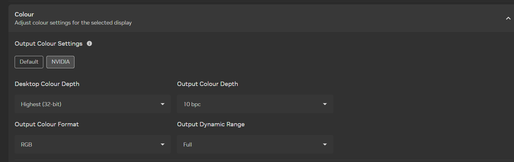
<!--  -->

**5: Klicka på Video, aktivera båda. No mas.**

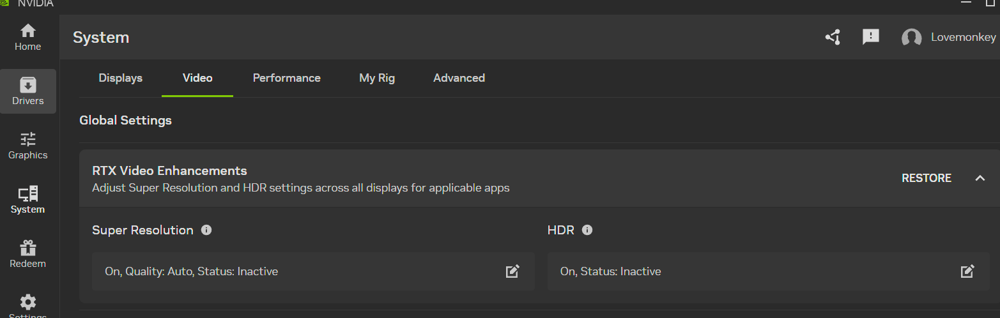
<!--  -->

**6: Öppna Graphics -> Global settings. Sätt som detta, förutom Max Frame Rate, som skall sättas till din max monitor Hz -3 (141 eller 162 beroende på HDMI eller displayport).**

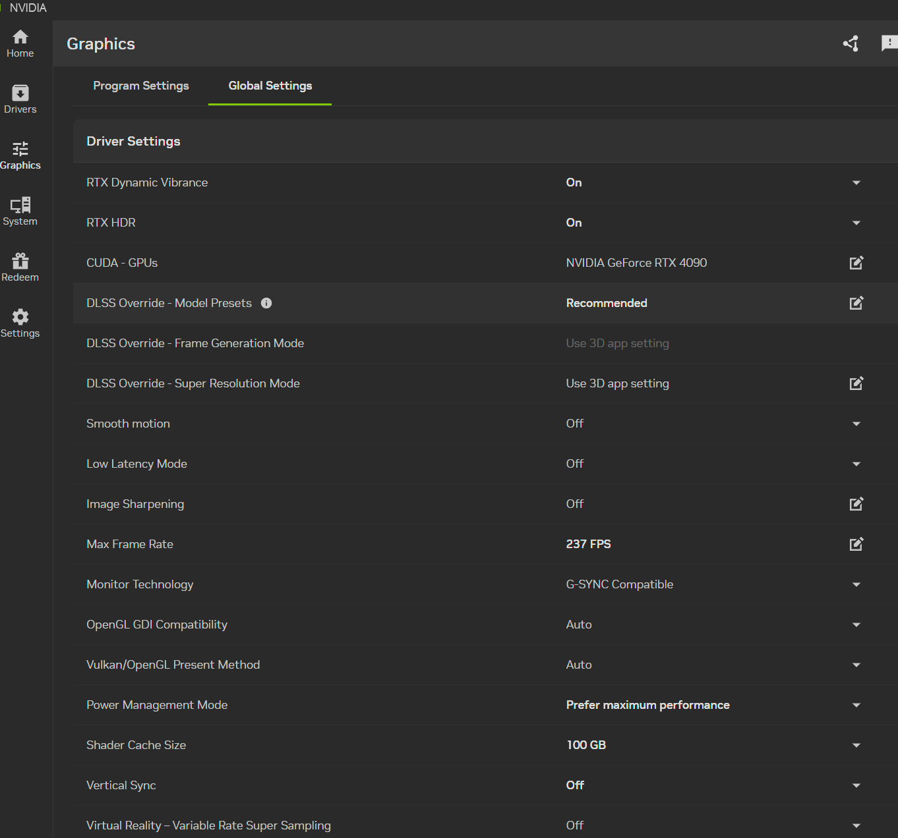
<!--  -->

**Att tänka på**
* Om ett spel inte stödjer DLSS och du tycker det är choppy, sätt igång Smooth Motion specifikt för det spelet i Program Settings
* Low Latency mode on/off märker jag själv ingen skillnad på, but you might, undvik Ultra bara. Om spelet du spelar har Nvidia Reflex Low Latency så aktivera det i spelet istället, det överskrider den inställningen n also work bettur

Max shader cache får du bestämma själv vad du har utrymme för. Jag satte 100 GB när The Last of Us kom ut och skulle konstant kompilera om sina shaders. Men det är en jävla overkill:

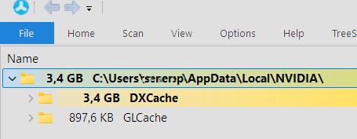
<!--  -->

**7: Finns lite legacy settings längre ner. Många är irrelevanta för moderna spel, men ibland kanske man spelar någon gammal goding. ***Av mest intresse är eventuellt Background Application Max Frame Rate*** - Om du tabbar ut från spel och gör annat och inte vill att datorn ska sluka resurser i onödan så kan du sätta den på typ 10-30 fps. Lägre kan antagligen orsaka problem när man tabbar tillbaka in.**

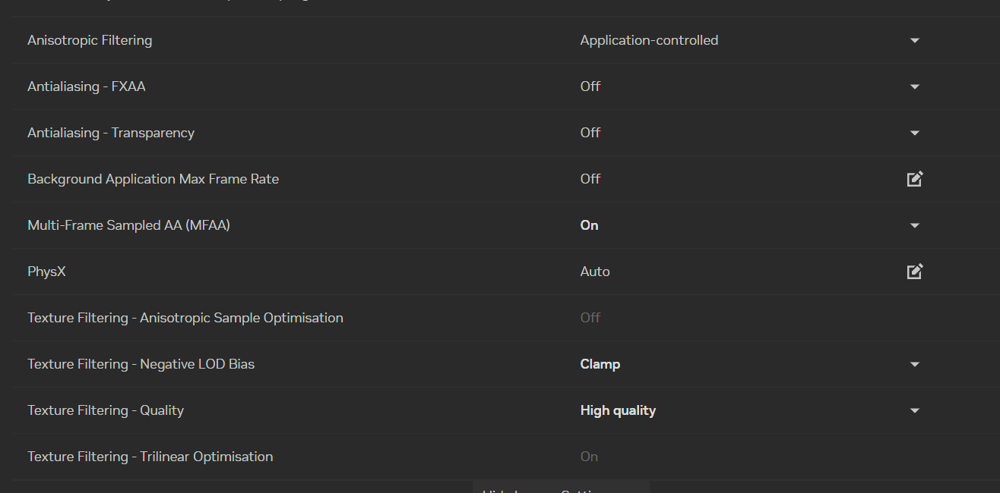
<!--  -->

**8: Kalibrera HDR! Öppna Windows HDR Calibration och följ instruktionerna 4 real good times**

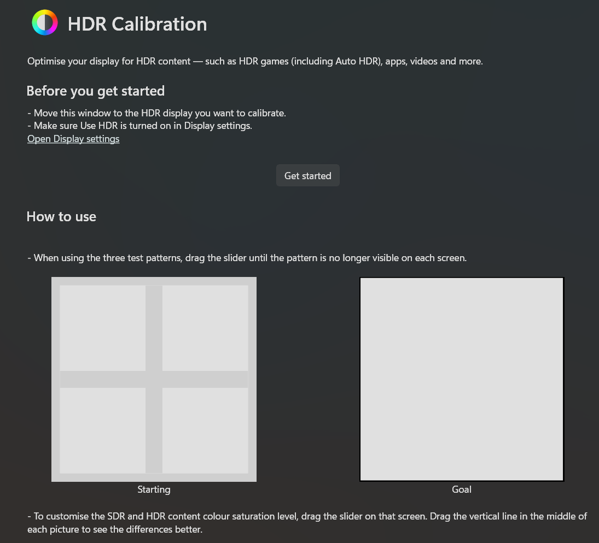

# ENJOY U LIL BISH
